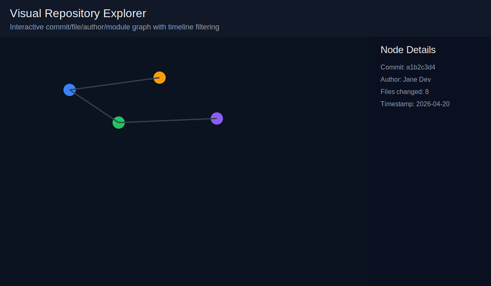

# Git History LLM

**Repository history reasoning for developer intelligence and Zayvora pipelines.**

Git History LLM now goes beyond commit summarization. It analyzes commit metadata, categorizes work patterns, builds change graphs, and generates structured insights/JSON outputs suitable for machine reasoning systems.

## Purpose

Use git history as a reasoning signal to answer questions such as:

- Which modules are unstable?
- Where does code churn concentrate?
- Which contributors repeatedly touch the same hotspots?
- Are refactor cycles emerging in specific parts of the repo?

## Architecture

```text
src/
  git_loader/
    repo_loader.py        # repository + commit metadata extraction
  history_parser/
    commit_parser.py      # commit categorization + pattern detection
  commit_analyzer/
    change_graph.py       # developer/file/module graph via networkx
    timeline.py           # commit-frequency, major changes, release phases
  insight_engine/
    insights.py           # risk, churn, hotspots, refactor-cycle insights
  cli/
    git_history_cli.py    # unified CLI for analyze/insights/timeline/contributors
```

## Key Features

### 1) Git Data Loader
- Loads any git repository path.
- Streams commit history using `GitPython` (`iter_commits`) to avoid loading everything at once.
- Extracts metadata:
  - `commit_id`
  - `author`
  - `timestamp`
  - `files_changed`
  - `lines_added`
  - `lines_removed`
  - `commit_message`
- Tracks branch structure (`branch -> head commit`).

### 2) Commit Parsing
- Categorizes commits into:
  - `feature`
  - `bugfix`
  - `refactor`
  - `docs`
  - `infra`
- Detects commit patterns such as `fix:`, `feat:`, and `refactor:`.

### 3) Change Graph (networkx)
- Builds relationships:
  - `developer -> file`
  - `file -> module`
  - `module -> commit frequency`

### 4) Insight Engine
Generates insights including:
- most active files
- unstable modules
- high churn code
- contributor hotspots
- refactor cycles

Example insight:

```json
{
  "module": "zayvora/runtime",
  "risk": "high",
  "reason": "frequent changes across multiple commits"
}
```

### 5) Timeline View
Produces timeline signals for:
- commit frequency
- major changes (large churn)
- release-phase commits

## CLI Usage

Run via module:

```bash
python3 -m src.cli.git_history_cli analyze <repo> --json
```

Commands:

```bash
git-history analyze <repo>
git-history insights <repo>
git-history timeline <repo>
git-history contributors <repo>
```

Current Python-module equivalents:

```bash
python3 -m src.cli.git_history_cli analyze <repo>
python3 -m src.cli.git_history_cli insights <repo>
python3 -m src.cli.git_history_cli timeline <repo>
python3 -m src.cli.git_history_cli contributors <repo>
```

All commands support:
- `--limit N` (optional commit cap)
- `--json` (structured export)

## Zayvora Integration JSON

`--json` emits a reasoning-friendly payload with this shape:

```json
{
  "repo": "",
  "commits": [],
  "insights": [],
  "contributors": [],
  "modules": []
}
```

This enables downstream systems (like Zayvora) to reason over repository evolution programmatically.

## Dependencies

- Python 3.10+
- Git installed and available in PATH
- `gitpython`
- `networkx`

Install dependencies in your environment as needed.

## Backward Compatibility

`python3 -m cli.git_history_llm ...` is retained as a compatibility entrypoint and delegates to the new CLI implementation.

## License

MIT — see `LICENSE`.


## Visual Repository Explorer

Use the graph workflow to export visualization data and open the interactive browser UI:

```bash
git-history graph <repo>
```

Example:

```bash
git-history graph ./repo
```

Generated artifacts:

- `output/graph.json` — node/edge graph for commits, files, authors, modules.
- `output/insights.json` — reasoning payload for Zayvora.

UI capabilities (`ui/index.html`):

- interactive D3 force graph
- zoom and pan
- node hover details
- click-to-highlight connected nodes
- timeline slider to filter visible commits by recency
- node detail panel for commit/file/author/module context

Type colors:

- commit: blue
- file: green
- author: orange
- module: purple


